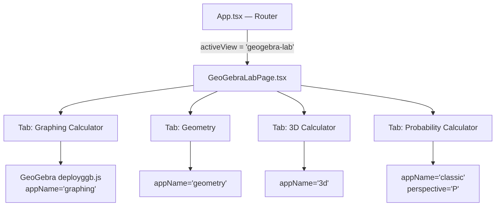

# Tích hợp GeoGebra Lab — Phòng thí nghiệm toán học tương tác

Thêm module **GeoGebra Lab** vào ứng dụng, cung cấp 4 chế độ: Graphing Calculator, Geometry, 3D Calculator, và Probability Calculator — sử dụng GeoGebra Apps Embedding API chính thức.

## Proposed Changes

### Tổng quan kiến trúc

Mỗi tab sẽ tạo **một GeoGebra applet instance riêng** với `appName` và parameters phù hợp, sử dụng cùng `deployggb.js` CDN đã load sẵn từ `GeoGebraView.tsx`.

---

### Component mới

#### [NEW] [GeoGebraLabPage.tsx](file:///d:/Programs/hinh/frontend/src/components/GeoGebraLabPage.tsx)

Component chính cho module GeoGebra Lab. Bao gồm:

- **Tab navigation** 4 chế độ: Graphing, Geometry, 3D, Probability
- **GeoGebra applet container** full-featured (toolbar, algebra input, menu bar)
- **Command input bar** — ô nhập lệnh GeoGebra (evalCommand) cho power users
- **Quick actions panel** — các preset mẫu cho từng chế độ (VD: vẽ parabol, elip, tam giác...)
- **Export controls** — xuất PNG/SVG/PDF trực tiếp từ GeoGebra API
- **Save/Load state** — lưu/tải trạng thái applet bằng base64

Cấu hình GeoGebra cho mỗi tab:

| Tab | `appName` | `showToolBar` | `showAlgebraInput` | `showMenuBar` | `perspective` | Ghi chú |
|---|---|---|---|---|---|---|
| Graphing | `"graphing"` | `true` | `true` | `true` | — | Đồ thị hàm số 2D, phương trình, bất PT |
| Geometry | `"geometry"` | `true` | `true` | `true` | — | Hình học phẳng: tam giác, đường tròn, đa giác |
| 3D | `"3d"` | `true` | `true` | `true` | — | Đồ thị 3D, mặt phẳng, khối |
| Probability | `"classic"` | `true` | `true` | `true` | `"P"` | Phân phối chuẩn, nhị thức, tính xác suất |

---

### Routing & Navigation

#### [MODIFY] [App.tsx](file:///d:/Programs/hinh/frontend/src/App.tsx)

1. **`AppView` type** — thêm `'geogebra-lab'`
2. **`viewPaths`** — thêm `'geogebra-lab': '/geogebra-lab'`
3. **Tools dropdown menu** — thêm item "GeoGebra Lab" với icon và mô tả, đặt sau item "Mô phỏng"
4. **Main content area** — thêm render condition cho `activeView === 'geogebra-lab'`
5. **Footer navigation** — thêm link "GeoGebra Lab" vào nhóm "Sản phẩm"

Thay đổi cụ thể:
- Dòng 35: Thêm `'geogebra-lab'` vào union type `AppView`
- Dòng 55-73: Thêm path mapping
- Dòng 862: Thêm `activeView === 'geogebra-lab'` vào điều kiện active của nút "Công cụ"
- Dòng 883-889: Thêm menu item mới sau "Mô phỏng"
- Dòng 1185: Thêm render block cho GeoGebra Lab page

---

### Styling

#### [MODIFY] [styles.css](file:///d:/Programs/hinh/frontend/src/styles.css)

Thêm styles cho GeoGebra Lab page:

- `.gglab-page` — container chính full-height
- `.gglab-header` — header với tabs và controls
- `.gglab-tabs` — tab bar 4 chế độ, responsive
- `.gglab-tab` — từng tab item, active state với gradient underline
- `.gglab-workspace` — khung chứa applet, chiếm hết chiều cao còn lại  
- `.gglab-applet` — container cho GeoGebra applet, responsive resize
- `.gglab-sidebar` — panel phụ (command input, presets, export)
- `.gglab-cmd-input` — ô nhập lệnh GeoGebra
- `.gglab-presets` — grid các preset mẫu
- `.gglab-preset-card` — card cho mỗi preset mẫu
- `.gglab-actions` — toolbar phụ (undo/redo, clear, export)
- Responsive: mobile có sidebar collapse và tabs scroll horizontal

Design token: sử dụng palette hiện có (gradient tím/xanh, glassmorphism card).

---

## Chi tiết GeoGebraLabPage

### 1. Graphing Calculator
- **Mặc định**: Hiển thị đồ thị hàm số 2D với algebra panel
- **Presets**: `y = x^2`, `y = sin(x)`, `x^2 + y^2 = 4` (circle), `x^2/4 + y^2/9 = 1` (ellipse), `x^2/4 - y^2/9 = 1` (hyperbola), `y = (x-1)*(x+2)` (parabola), `y >= x` (bất PT)
- **Full toolbar**: đầy đủ công cụ GeoGebra Graphing (tính cực trị, giao điểm, tiếp tuyến...)

### 2. Geometry
- **Mặc định**: Canvas hình học phẳng với toolbar geometry
- **Presets**: Tam giác đều, đường tròn ngoại tiếp, trung điểm, tiếp tuyến, đa giác đều, góc, phép đối xứng
- **Full toolbar**: Point, Line, Polygon, Circle, Angle, Midpoint, Perpendicular, Parallel, Tangent, Reflection...

### 3. 3D Calculator
- **Mặc định**: Không gian 3D với axes, xoay/zoom tương tác
- **Presets**: Mặt phẳng `z = x + y`, Mặt cầu `x^2+y^2+z^2=9`, Hình trụ, Hình nón, Parabol xoay `z = x^2 + y^2`
- **Full toolbar**: 3D Point, Plane, Sphere, Prism, Pyramid, Net, Rotate View, Volume...

### 4. Probability Calculator
- **Mặc định**: Mở trực tiếp bảng phân phối xác suất
- **perspective**: `"P"` để mở Probability Calculator view
- **Hỗ trợ**: Phân phối chuẩn (Normal), Nhị thức (Binomial), Poisson, Student-t, Chi-squared, F, Exponential, Cauchy, Weibull, Gamma, Logistic, Log-normal, Hypergeometric, Pascal, Zipf

### API Integration (GeoGebra Apps API)
- `evalCommand()` — chạy lệnh từ ô input
- `reset()` / `newConstruction()` — xoá hết / reset
- `undo()` / `redo()` — hoàn tác
- `getBase64()` — lưu trạng thái applet
- `setBase64()` — tải lại trạng thái
- `getPNGBase64()` — export PNG
- `exportSVG()` — export SVG
- `exportPDF()` — export PDF
- `getAllObjectNames()` — liệt kê objects

---

## Verification Plan

### Automated Tests
- `npm run build` — đảm bảo TypeScript compile thành công
- `npm run dev` — kiểm tra app chạy không lỗi

### Manual Verification (Browser)
1. Mở app → click "Công cụ" → thấy menu item "GeoGebra Lab"
2. Click vào → chuyển sang trang `/geogebra-lab`
3. Kiểm tra 4 tab hoạt động, mỗi tab load đúng GeoGebra applet
4. Tab Graphing: nhập `y=x^2` → thấy parabol
5. Tab Geometry: dùng toolbar vẽ tam giác, đường tròn
6. Tab 3D: xoay mô hình 3D bằng chuột
7. Tab Probability: thấy giao diện phân phối xác suất
8. Ô command input: nhập lệnh → thực thi
9. Export PNG/SVG hoạt động
10. Responsive: thu nhỏ cửa sổ → layout co giãn hợp lý

